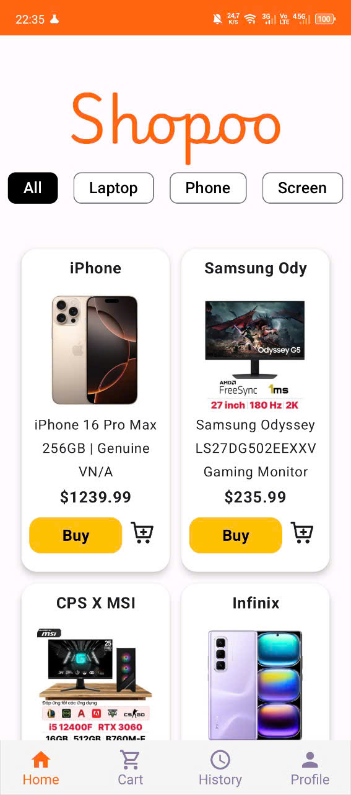
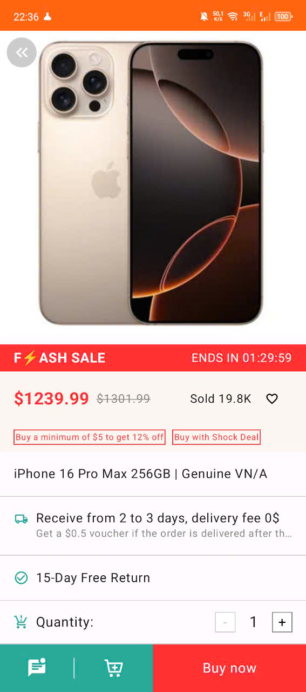
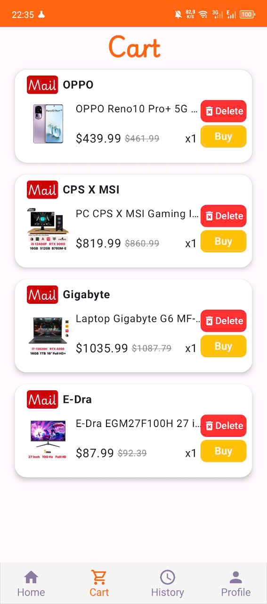
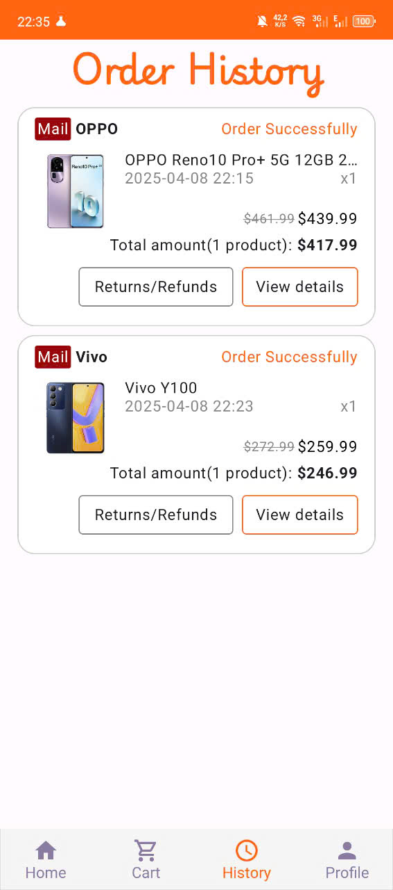
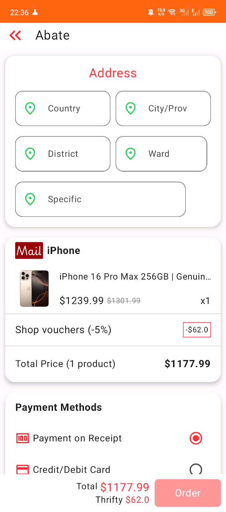
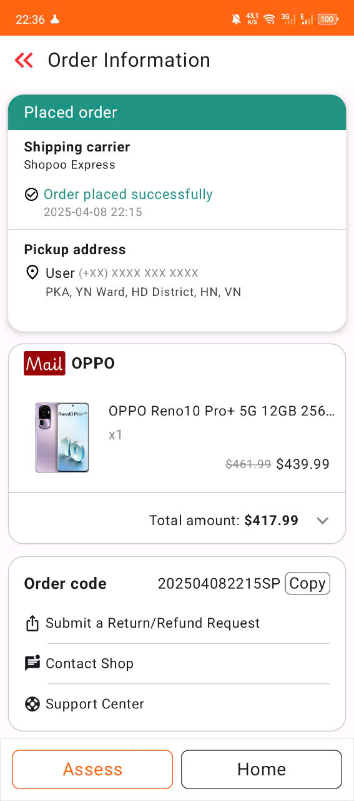

# 🛒 EazyShop - Android Shopping App

EazyShop là một ứng dụng mua sắm đơn giản được phát triển bằng **Jetpack Compose** với kiến trúc **MVVM**, sử dụng **Room Database** để lưu trữ dữ liệu cục bộ.

## 🚀 Tính năng chính

- 🏠 Hiển thị danh sách sản phẩm với ảnh, tên, giá, mô tả
- 🔍 Xem chi tiết sản phẩm
- ➕ Thêm sản phẩm vào giỏ hàng
- 🛍️ Mua hàng trực tiếp từ trang chính
- 🧾 Quản lý sản phẩm (nếu có: thêm/sửa/xoá)
- 🎨 UI hiện đại sử dụng Jetpack Compose + Material 3

## 🧱 Công nghệ sử dụng

| Công nghệ | Vai trò |
|----------|---------|
| Jetpack Compose | Giao diện người dùng |
| Room DB | Lưu trữ dữ liệu cục bộ |
| MVVM | Kiến trúc ứng dụng |
| Kotlin | Ngôn ngữ lập trình chính |
| Navigation Compose | Điều hướng giữa các màn hình |
| Material3 | Giao diện hiện đại |

## 🖼️ Demo giao diện

Một số màn hình chính trong ứng dụng:

| Trang chính | Chi tiết sản phẩm | Giỏ hàng |
|------------|-------------------|----------|
|  |  |  |

| Lịch sử đơn hàng | Đặt hàng | Chi tiết đơn |
|------------------|---------------------|----------------|
|  |  |  |

| Hồ sơ người dùng |
|------------------|
|  |


## 📦 Cài đặt & Chạy dự án

```bash
git clone https://github.com/AnhQuocs/EZShop.git
